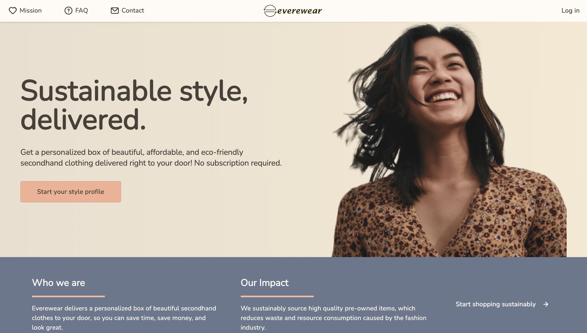
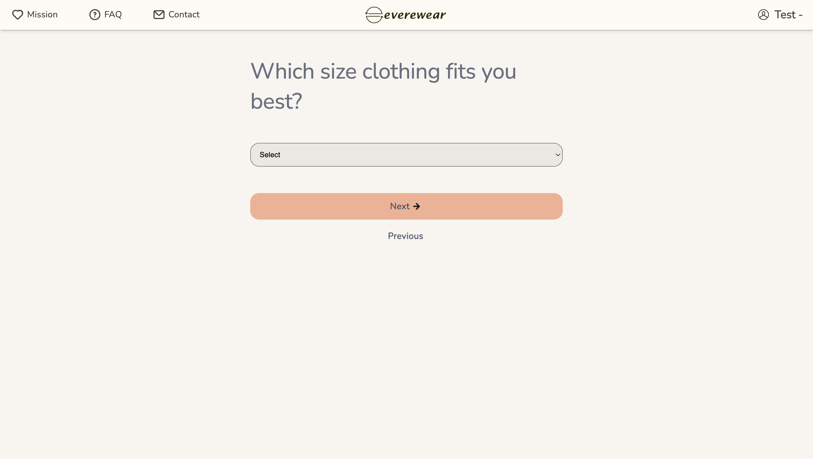
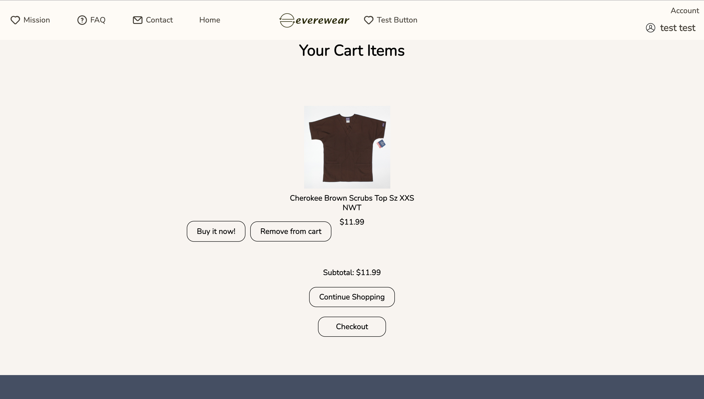
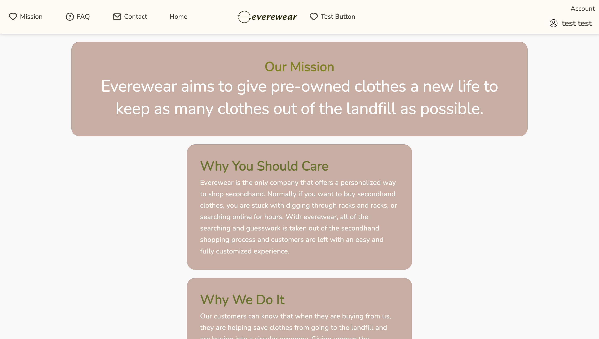
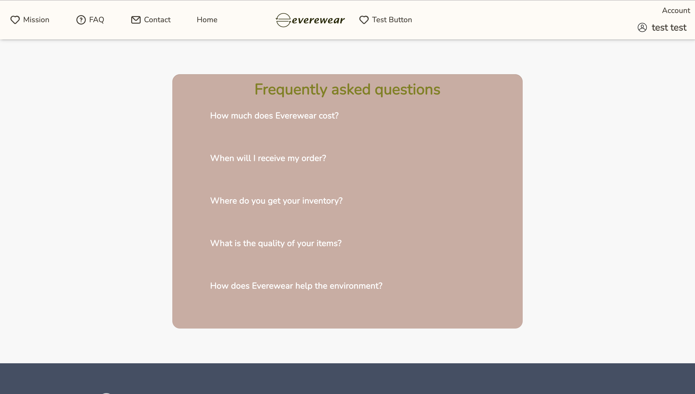
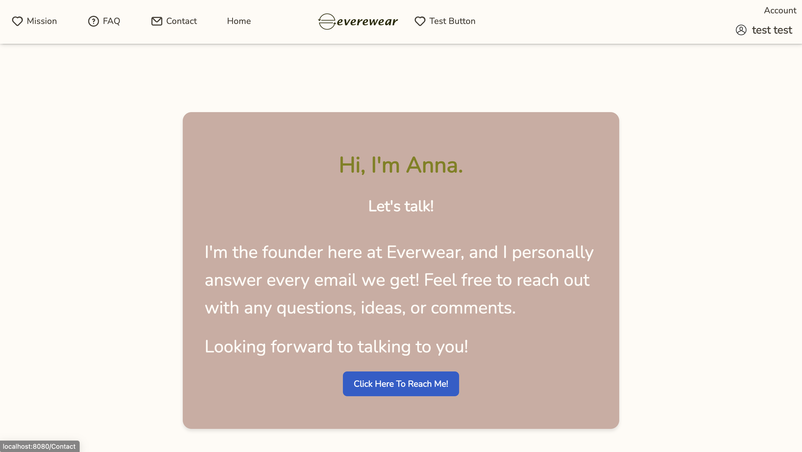

# How to Register
</img>

- Press Log in located top right

</img>

 - When at the login page press "i dont have an account" to register.

</img>

 - When brought to the sign up page, fill out all the fields and press submit.

 

# How to Login
</img>

- Press the login button located top right of the home page

</img>

-  Fill out the fields with correct information and press submit

# Navigating to Style page

</img>

- In the home page press "Style your profile".

</img>

- Select your preferred styles from the drop-down selection and submit once everything is filled up.

</img>
- You will be brought to this page where you can look at products based on style preference.

# Searching For Products
</img>
- Click the search bar and type in a specific product you are looking for.

# Buying a Product

</img>

- Once on the product page add your preferred products to cart by pressing the `Add to Cart` button.

</img>

- `Buy it now` will direct you to goodwills website with the product.
- `Remove from cart` will remove the product from cart.
- `Continue shopping` will redirect you back to the products page.

# Accessing Mission, FAQ and Contact pages

</img>
</img>
</img>

- Press on the Mission, FAQ or contact buttons located on the navigation tab to access them.

