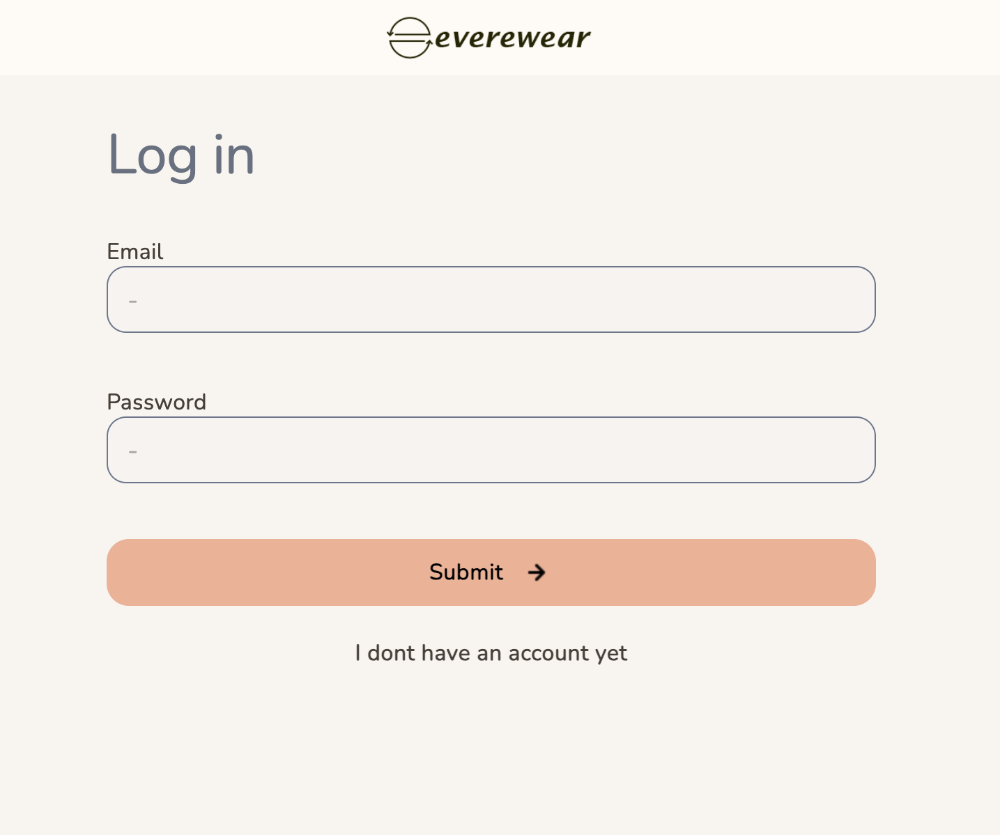
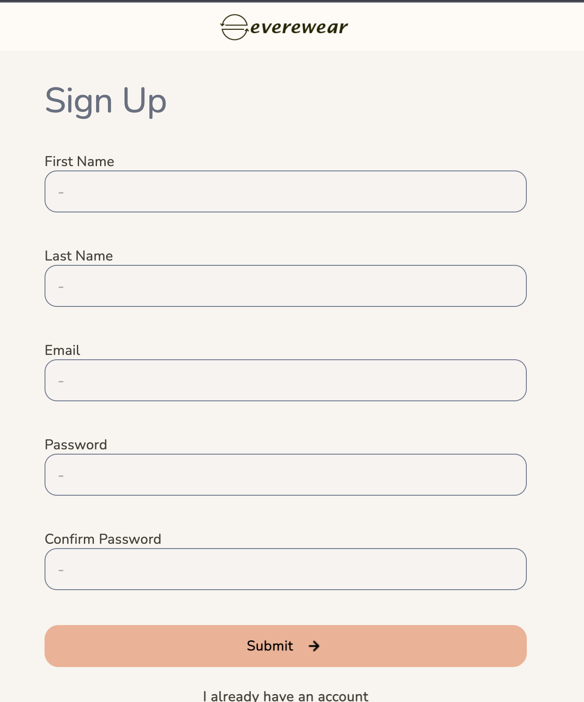

# Register

 1. When at the login page press "i dont have an account" to register.

 2. When brought to the sign up page, fillout all the fields and press submit.

 3. You will now be brought back to the log in page to where you can log in using the information used to sign up.

